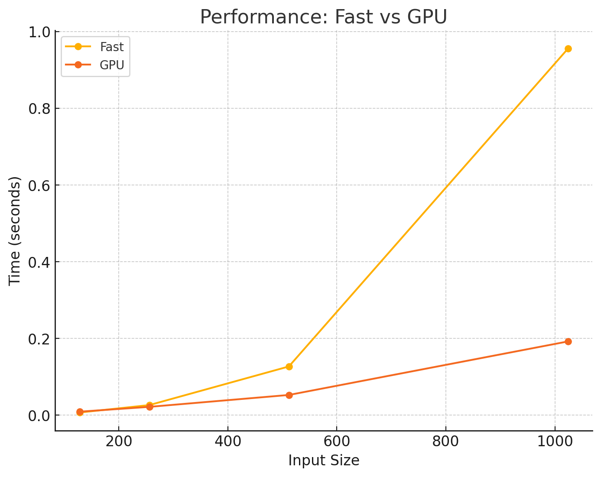

MAP

================================================================================
 Parallel Accelerator Optimizing:  Function tensor_map.<locals>._map, G:\My Driv
e\School\Semesters\Fall_2024\ML_Engineering\Minitorch\mod3-
Ceudan\minitorch\fast_ops.py (166)
================================================================================


Parallel loop listing for  Function tensor_map.<locals>._map, G:\My Drive\School\Semesters\Fall_2024\ML_Engineering\Minitorch\mod3-Ceudan\minitorch\fast_ops.py (166)
----------------------------------------------------------------------------------|loop #ID
    def _map(                                                                     |
        out: Storage,                                                             |
        out_shape: Shape,                                                         |
        out_strides: Strides,                                                     |
        in_storage: Storage,                                                      |
        in_shape: Shape,                                                          |
        in_strides: Strides,                                                      |
    ) -> None:                                                                    |
        # TODO: Implement for Task 3.1.                                           |
        if not (len(out_shape) <= MAX_DIMS and len(in_shape) <= MAX_DIMS):        |
            raise ValueError("Shapes exceed maximum dimensions.")                 |
                                                                                  |
        if (                                                                      |
            len(out_shape) == len(in_shape)                                       |
            and (out_shape == in_shape).all()-------------------------------------| #0
            and (out_strides == in_strides).all()---------------------------------| #1
        ):                                                                        |
            # If strides are the same, we can avoid indexing                      |
            for i in prange(len(out)):--------------------------------------------| #2
                out[i] = fn(in_storage[i])                                        |
                # out[i] += 1                                                     |
        else:                                                                     |
            for out_pos in prange(len(out)):--------------------------------------| #3
                out_ind = np.empty(MAX_DIMS, dtype=np.int32)                      |
                in_ind = np.empty(MAX_DIMS, dtype=np.int32)                       |
                to_index(out_pos, out_shape, out_ind)                             |
                broadcast_index(out_ind, out_shape, in_shape, in_ind)             |
                in_pos = index_to_position(in_ind, in_strides)                    |
                out[out_pos] = fn(in_storage[in_pos])                             |
                # out[out_pos] += 1 # FIX THIS FN IT HAS PARRALELIZATION ISSUE    |
--------------------------------- Fusing loops ---------------------------------
Attempting fusion of parallel loops (combines loops with similar properties)...
Following the attempted fusion of parallel for-loops there are 4 parallel for-
loop(s) (originating from loops labelled: #0, #1, #2, #3).
--------------------------------------------------------------------------------
----------------------------- Before Optimisation ------------------------------
--------------------------------------------------------------------------------
------------------------------ After Optimisation ------------------------------
Parallel structure is already optimal.
--------------------------------------------------------------------------------
--------------------------------------------------------------------------------

---------------------------Loop invariant code motion---------------------------
Allocation hoisting:
The memory allocation derived from the instruction at G:\My Drive\School\Semeste
rs\Fall_2024\ML_Engineering\Minitorch\mod3-Ceudan\minitorch\fast_ops.py (189) is
 hoisted out of the parallel loop labelled #3 (it will be performed before the
loop is executed and reused inside the loop):
   Allocation:: out_ind = np.empty(MAX_DIMS, dtype=np.int32)
    - numpy.empty() is used for the allocation.
The memory allocation derived from the instruction at G:\My Drive\School\Semeste
rs\Fall_2024\ML_Engineering\Minitorch\mod3-Ceudan\minitorch\fast_ops.py (190) is
 hoisted out of the parallel loop labelled #3 (it will be performed before the
loop is executed and reused inside the loop):
   Allocation:: in_ind = np.empty(MAX_DIMS, dtype=np.int32)
    - numpy.empty() is used for the allocation.
None
ZIP

================================================================================
 Parallel Accelerator Optimizing:  Function tensor_zip.<locals>._zip, G:\My Driv
e\School\Semesters\Fall_2024\ML_Engineering\Minitorch\mod3-
Ceudan\minitorch\fast_ops.py (223)
================================================================================


Parallel loop listing for  Function tensor_zip.<locals>._zip, G:\My Drive\School\Semesters\Fall_2024\ML_Engineering\Minitorch\mod3-Ceudan\minitorch\fast_ops.py (223)
----------------------------------------------------------------------------------------------------------------------|loop #ID
    def _zip(
 |
        out: Storage,
 |
        out_shape: Shape,
 |
        out_strides: Strides,
 |
        a_storage: Storage,
 |
        a_shape: Shape,
 |
        a_strides: Strides,
 |
        b_storage: Storage,
 |
        b_shape: Shape,
 |
        b_strides: Strides,
 |
    ) -> None:
 |
        # TODO: Implement for Task 3.1.
 |
        # avoid repeated initializations
 |
        if not (
 |
            len(out_shape) <= MAX_DIMS
 |
            and len(a_shape) <= MAX_DIMS
 |
            and len(b_shape) <= MAX_DIMS
 |
        ):
 |
            raise ValueError("Shapes exceed maximum dimensions.")
 |

 |
        if (
 |
            len(out_shape) == len(a_shape)
 |
            and len(out_shape) == len(b_shape)
 |
            and (out_strides == a_strides).all()----------------------------------------------------------------------| #4
            and (out_shape == a_shape).all()--------------------------------------------------------------------------| #5
            and (out_strides == b_strides).all()----------------------------------------------------------------------| #6
            and (out_shape == b_shape).all()--------------------------------------------------------------------------| #7
        ):
 |
            # If pos order is the same, we can avoid indexing
 |
            for i in prange(len(out)):--------------------------------------------------------------------------------| #8
                out[i] = fn(a_storage[i], b_storage[i])
 |
        else:
 |
            # we have to do some index conversions
 |
            # iterate over output elements in out_storage, and find appropriate input from a_storage and b_storage    |
            for out_pos in prange(len(out)):--------------------------------------------------------------------------| #9
                out_ind = np.empty(MAX_DIMS, dtype=np.int32)
 |
                a_ind = np.empty(MAX_DIMS, dtype=np.int32)
 |
                b_ind = np.empty(MAX_DIMS, dtype=np.int32)
 |
                to_index(out_pos, out_shape, out_ind)
 |
                broadcast_index(out_ind, out_shape, a_shape, a_ind)
 |
                broadcast_index(out_ind, out_shape, b_shape, b_ind)
 |
                a_pos = index_to_position(a_ind, a_strides)
 |
                b_pos = index_to_position(b_ind, b_strides)
 |
                out[out_pos] = fn(a_storage[a_pos], b_storage[b_pos])
 |
--------------------------------- Fusing loops ---------------------------------
Attempting fusion of parallel loops (combines loops with similar properties)...
Following the attempted fusion of parallel for-loops there are 6 parallel for-
loop(s) (originating from loops labelled: #4, #5, #6, #7, #8, #9).
--------------------------------------------------------------------------------
----------------------------- Before Optimisation ------------------------------
--------------------------------------------------------------------------------
------------------------------ After Optimisation ------------------------------
Parallel structure is already optimal.
--------------------------------------------------------------------------------
--------------------------------------------------------------------------------

---------------------------Loop invariant code motion---------------------------
Allocation hoisting:
The memory allocation derived from the instruction at G:\My Drive\School\Semeste
rs\Fall_2024\ML_Engineering\Minitorch\mod3-Ceudan\minitorch\fast_ops.py (258) is
 hoisted out of the parallel loop labelled #9 (it will be performed before the
loop is executed and reused inside the loop):
   Allocation:: out_ind = np.empty(MAX_DIMS, dtype=np.int32)
    - numpy.empty() is used for the allocation.
The memory allocation derived from the instruction at G:\My Drive\School\Semeste
rs\Fall_2024\ML_Engineering\Minitorch\mod3-Ceudan\minitorch\fast_ops.py (259) is
 hoisted out of the parallel loop labelled #9 (it will be performed before the
loop is executed and reused inside the loop):
   Allocation:: a_ind = np.empty(MAX_DIMS, dtype=np.int32)
    - numpy.empty() is used for the allocation.
The memory allocation derived from the instruction at G:\My Drive\School\Semeste
rs\Fall_2024\ML_Engineering\Minitorch\mod3-Ceudan\minitorch\fast_ops.py (260) is
 hoisted out of the parallel loop labelled #9 (it will be performed before the
loop is executed and reused inside the loop):
   Allocation:: b_ind = np.empty(MAX_DIMS, dtype=np.int32)
    - numpy.empty() is used for the allocation.
None
REDUCE

================================================================================
 Parallel Accelerator Optimizing:  Function tensor_reduce.<locals>._reduce,
G:\My Drive\School\Semesters\Fall_2024\ML_Engineering\Minitorch\mod3-
Ceudan\minitorch\fast_ops.py (292)
================================================================================


Parallel loop listing for  Function tensor_reduce.<locals>._reduce, G:\My Drive\School\Semesters\Fall_2024\ML_Engineering\Minitorch\mod3-Ceudan\minitorch\fast_ops.py (292)
-----------------------------------------------------------------------------|loop #ID
    def _reduce(                                                             |
        out: Storage,                                                        |
        out_shape: Shape,                                                    |
        out_strides: Strides,                                                |
        a_storage: Storage,                                                  |
        a_shape: Shape,                                                      |
        a_strides: Strides,                                                  |
        reduce_dim: int,                                                     |
    ) -> None:                                                               |
        # TODO: Implement for Task 3.1.                                      |
        if not (len(out_shape) <= MAX_DIMS and len(a_shape) <= MAX_DIMS):    |
            raise ValueError("Shapes exceed maximum dimensions.")            |
                                                                             |
        for i in prange(len(out)):-------------------------------------------| #10
            # convert out_pos to out_index                                   |
            out_index: Index = np.empty(MAX_DIMS, dtype=np.int32)            |
            # size of the dimension to reduce                                |
            reduce_size = a_shape[reduce_dim]                                |
            to_index(i, out_shape, out_index)                                |
            out_pos = index_to_position(                                     |
                out_index, out_strides                                       |
            )  # perhaps we can use i instead ?                              |
                                                                             |
            # avoid accumulating in out during the for loop                  |
            reduce_stride = a_strides[reduce_dim]                            |
            first_a_pos = index_to_position(out_index, a_strides)            |
            res = out[out_pos]  # init result                                |
            for s in range(reduce_size):                                     |
                a_pos = first_a_pos + s * reduce_stride                      |
                res = fn(res, float(a_storage[a_pos]))                       |
            out[out_pos] = res                                               |
            # out[out_pos] = 1234                                            |
--------------------------------- Fusing loops ---------------------------------
Attempting fusion of parallel loops (combines loops with similar properties)...
Following the attempted fusion of parallel for-loops there are 1 parallel for-
loop(s) (originating from loops labelled: #10).
--------------------------------------------------------------------------------
----------------------------- Before Optimisation ------------------------------
--------------------------------------------------------------------------------
------------------------------ After Optimisation ------------------------------
Parallel structure is already optimal.
--------------------------------------------------------------------------------
--------------------------------------------------------------------------------

---------------------------Loop invariant code motion---------------------------
Allocation hoisting:
The memory allocation derived from the instruction at G:\My Drive\School\Semeste
rs\Fall_2024\ML_Engineering\Minitorch\mod3-Ceudan\minitorch\fast_ops.py (307) is
 hoisted out of the parallel loop labelled #10 (it will be performed before the
loop is executed and reused inside the loop):
   Allocation:: out_index: Index = np.empty(MAX_DIMS, dtype=np.int32)
    - numpy.empty() is used for the allocation.
None
MATRIX MULTIPLY

================================================================================
 Parallel Accelerator Optimizing:  Function _tensor_matrix_multiply, G:\My Drive
\School\Semesters\Fall_2024\ML_Engineering\Minitorch\mod3-
Ceudan\minitorch\fast_ops.py (328)
================================================================================


Parallel loop listing for  Function _tensor_matrix_multiply, G:\My Drive\School\Semesters\Fall_2024\ML_Engineering\Minitorch\mod3-Ceudan\minitorch\fast_ops.py (328)
----------------------------------------------------------------------------------------------------------------------------------------------------------|loop #ID
def _tensor_matrix_multiply(
                                     |
    out: Storage,
                                     |
    out_shape: Shape,
                                     |
    out_strides: Strides,
                                     |
    a_storage: Storage,
                                     |
    a_shape: Shape,
                                     |
    a_strides: Strides,
                                     |
    b_storage: Storage,
                                     |
    b_shape: Shape,
                                     |
    b_strides: Strides,
                                     |
) -> None:
                                     |
    """NUMBA tensor matrix multiply function.
                                     |

                                     |
    Should work for any tensor shapes that broadcast as long as
                                     |

                                     |
    ```
                                     |
    assert a_shape[-1] == b_shape[-2]
                                     |
    ```
                                     |

                                     |
    Optimizations:
                                     |

                                     |
    * Outer loop in parallel
                                     |
    * No index buffers or function calls
                                     |
    * Inner loop should have no global writes, 1 multiply.
                                     |

                                     |

                                     |
    Args:
                                     |
    ----
                                     |
        out (Storage): storage for `out` tensor
                                     |
        out_shape (Shape): shape for `out` tensor
                                     |
        out_strides (Strides): strides for `out` tensor
                                     |
        a_storage (Storage): storage for `a` tensor
                                     |
        a_shape (Shape): shape for `a` tensor
                                     |
        a_strides (Strides): strides for `a` tensor
                                     |
        b_storage (Storage): storage for `b` tensor
                                     |
        b_shape (Shape): shape for `b` tensor
                                     |
        b_strides (Strides): strides for `b` tensor
                                     |

                                     |
    Returns:
                                     |
    -------
                                     |
        None : Fills in `out`
                                     |

                                     |
    """
                                     |
    # assert a_shape[-1] == b_shape[-2], "a_shape[-1] != b_shape[-2]"
                                     |
    # a_batch_stride = a_strides[0] if a_shape[0] > 1 else 0
                                     |
    # b_batch_stride = b_strides[0] if b_shape[0] > 1 else 0
                                     |

                                     |
    # TODO: Implement for Task 3.2.
                                     |
    assert a_shape[-1] == b_shape[-2], "a_shape[-1] != b_shape[-2]"
                                     |
    a_batch_stride = a_strides[0] if a_shape[0] > 1 else 0
                                     |
    b_batch_stride = b_strides[0] if b_shape[0] > 1 else 0
                                     |
    out_batch_stride = out_strides[0] if out_shape[0] > 1 else 0
                                     |
    for batch in prange(out_shape[0]):--------------------------------------------------------------------------------------------------------------------| #11
        batch_idx_a = batch * a_batch_stride
                                     |
        batch_idx_b = batch * b_batch_stride
                                     |
        out_batch_idx = batch * out_batch_stride
                                     |
        for r in range(out_shape[-2]):
                                     |
            for c in range(out_shape[-1]):
                                     |
                acc = 0.0
                                     |
                for i in range(a_shape[-1]):  # want to do the inner loop before col
                                     |
                    # like BLAS implementation to be more cache friendly,
                                     |
                    # but this causes global writes
                                     |
                    acc += (
                                     |
                        a_storage[batch_idx_a + r * a_strides[-2] + i * a_strides[-1]]
                                     |
                        * b_storage[batch_idx_b + i * b_strides[-2] + c * b_strides[-1]]
                                     |
                    )
                                     |
                out[out_batch_idx + r * out_strides[-2] + c * out_strides[-1]] = acc
                                     |
    # a needs at least 1 dims and b needs at least 2 dims
                                     |
    # if(len(a_shape)<1 or len(b_shape)<2):
                                     |
    #     raise ValueError("Invalid shapes for matrix multiplication.")
                                     |
    # # check i a rows length matches b col length
                                     |
    # if(a_shape[-1]!=b_shape[-2]):
                                     |
    #     raise ValueError("Shapes do not match for matrix multiplication.")
                                     |

                                     |
    # # we need the batch strides to jump across batches in memory
                                     |
    # o_batch_stride = out_strides[0] if out_shape[0] > 1 else 0
                                     |

                                     |
    # for b_num in prange(out_shape[0]): # all the matrices should have the same batch size
                                     |
    #     b_idx_a = b_num * a_batch_stride
                                     |
    #     b_idx_b = b_num * b_batch_stride
                                     |
    #     b_idx_o = b_num * o_batch_stride
                                     |
    #     for r in range(out_shape[-2]): # iterate over rows of a
                                     |
    #         for c in range(out_shape[-1]): # iterate over cols of b
                                     |
    #             sum = 0.0
                                     |
    #             for i in range(a_shape[-1]):  # iterate over len(row[i])==len(col[i])
                                     |
    #                 sum += (a_storage[b_idx_a + r * a_strides[-2] + i * a_strides[-1]] * b_storage[b_idx_b + i * b_strides[-2] + c * b_strides[-1]])    |
    #             out[b_idx_o + r * out_strides[-2] + c * out_strides[-1]] = sum # store results
                                     |
--------------------------------- Fusing loops ---------------------------------
Attempting fusion of parallel loops (combines loops with similar properties)...
Following the attempted fusion of parallel for-loops there are 1 parallel for-
loop(s) (originating from loops labelled: #11).
--------------------------------------------------------------------------------
----------------------------- Before Optimisation ------------------------------
--------------------------------------------------------------------------------
------------------------------ After Optimisation ------------------------------
Parallel structure is already optimal.
--------------------------------------------------------------------------------
--------------------------------------------------------------------------------

---------------------------Loop invariant code motion---------------------------
Allocation hoisting:
No allocation hoisting found
None


## 3_4

When comparing the performance of the GPU vs CPU processing, we can see that as the input matrices get larger the GPU gets relatively better as its parralelizism gets more effective. At input size of 1000 GPU is about 5 times faster.

# 3.5
Below are my training logs.

### Split Dataset with Hidden Size 100
### CPU
Epoch  0  loss  6.427501139021373 correct 32
Epoch  10  loss  4.383007386314448 correct 39
Epoch  20  loss  3.607670306604136 correct 42
Epoch  30  loss  2.6939548163020968 correct 43
Epoch  40  loss  4.818516307501968 correct 47
Epoch  50  loss  3.2282506869727143 correct 48
Epoch  60  loss  2.537268517621877 correct 48
Epoch  70  loss  0.9791594995280114 correct 49
Epoch  80  loss  2.816725145548755 correct 45
Epoch  90  loss  2.2830944613210247 correct 48
Epoch  100  loss  2.2075831451796595 correct 48
Epoch  110  loss  2.6797086602473903 correct 46
Epoch  120  loss  1.7862336210089529 correct 50
Epoch  130  loss  1.561305250448948 correct 49
Epoch  140  loss  1.7933471568522228 correct 49
Epoch  150  loss  1.2106972179908353 correct 48
Epoch  160  loss  1.1803781104342568 correct 49
Epoch  170  loss  1.2677331208543787 correct 50
Epoch  180  loss  0.3876421353214148 correct 50
Epoch  190  loss  0.9105720683158225 correct 50
Epoch  200  loss  0.700658399288256 correct 49
Epoch  210  loss  1.2242134540771754 correct 49
Epoch  220  loss  1.9254245725582517 correct 50
Epoch  230  loss  0.2503980488757744 correct 49
Epoch  240  loss  0.5394964444187937 correct 50
Epoch  250  loss  0.3160515517900786 correct 50
Epoch  260  loss  1.0909484783592467 correct 50
Epoch  270  loss  0.37719894869166964 correct 49
Epoch  280  loss  0.6700598591572086 correct 50
Epoch  290  loss  0.81648545250346 correct 50
Epoch  300  loss  0.37078612426848245 correct 49
Epoch  310  loss  0.5542241162949937 correct 50
Epoch  320  loss  0.7981880034097869 correct 50
Epoch  330  loss  0.5328714196803833 correct 50
Epoch  340  loss  0.3104366257984448 correct 49
Epoch  350  loss  0.5828208718689932 correct 50
Epoch  360  loss  0.7456387306343208 correct 50
Epoch  370  loss  0.07672890238446488 correct 50
Epoch  380  loss  0.18797510490931235 correct 50
Epoch  390  loss  0.0946772258017803 correct 50
Epoch  400  loss  0.967493795827526 correct 50
Epoch  410  loss  0.16663517498526426 correct 49
Epoch  420  loss  0.12180574397580615 correct 50
Epoch  430  loss  0.23869844112481065 correct 50
Epoch  440  loss  0.19115375931849943 correct 50
Epoch  450  loss  0.3773704752266526 correct 50
Epoch  460  loss  0.6796623206635151 correct 50
Epoch  470  loss  0.3574269026182305 correct 50
Epoch  480  loss  0.5106939486822616 correct 50
Epoch  490  loss  0.3299916167881394 correct 50
Total time per epoch (seconds): 0.17494882678985596
#### GPU
Epoch  0  loss  9.212060878235189 correct 21
Epoch  10  loss  8.21930087903572 correct 34
Epoch  20  loss  5.666704244513889 correct 40
Epoch  30  loss  6.002060444414708 correct 45
Epoch  40  loss  3.7804970173648265 correct 45
Epoch  50  loss  2.6810661750213276 correct 45
Epoch  60  loss  4.367593697160325 correct 44
Epoch  70  loss  2.8202413485648545 correct 46
Epoch  80  loss  2.3003670685020015 correct 48
Epoch  90  loss  1.6656708946662138 correct 47
Epoch  100  loss  2.105086926822217 correct 49
Epoch  110  loss  1.3819341897752437 correct 47
Epoch  120  loss  2.173726490116646 correct 48
Epoch  130  loss  2.277251420732982 correct 47
Epoch  140  loss  1.4803922253076491 correct 47
Epoch  150  loss  1.445994564494081 correct 49
Epoch  160  loss  1.1221063051370603 correct 49
Epoch  170  loss  0.7964935495337785 correct 48
Epoch  180  loss  0.8648285811878743 correct 48
Epoch  190  loss  1.2644361359886591 correct 49
Epoch  200  loss  0.6005892495397911 correct 48
Epoch  210  loss  1.3987121085449326 correct 48
Epoch  220  loss  0.24608963905546 correct 50
Epoch  230  loss  1.1197928360713527 correct 48
Epoch  240  loss  0.225321104957411 correct 50
Epoch  250  loss  1.5558715152432572 correct 49
Epoch  260  loss  1.092757331942219 correct 49
Epoch  270  loss  0.5871028922779619 correct 48
Epoch  280  loss  1.0889108448343159 correct 49
Epoch  290  loss  1.4842042330460332 correct 50
Epoch  300  loss  0.9788024960971632 correct 49
Epoch  310  loss  0.6921138183079281 correct 48
Epoch  320  loss  1.0144945011028603 correct 50
Epoch  330  loss  1.5321492948034527 correct 50
Epoch  340  loss  0.9468819197396001 correct 50
Epoch  350  loss  1.2743785866801065 correct 50
Epoch  360  loss  1.5366766370131277 correct 48
Epoch  370  loss  1.434366799824504 correct 50
Epoch  380  loss  0.7819058216354938 correct 50
Epoch  390  loss  1.3212286966566267 correct 50
Epoch  400  loss  0.8589334368365144 correct 49
Epoch  410  loss  0.5208104822283299 correct 49
Epoch  420  loss  0.9977733322220572 correct 50
Epoch  430  loss  0.12437244221906919 correct 49
Epoch  440  loss  0.7581998995793908 correct 49
Epoch  450  loss  1.4278026628203242 correct 50
Epoch  460  loss  1.3705512993752036 correct 50
Epoch  470  loss  0.6324190112557401 correct 49
Epoch  480  loss  0.28304183673587335 correct 49
Epoch  490  loss  2.1794271132744707 correct 47
Total time per epoch (seconds): 1.616498833656311


### Split Dataset with Hidden Size 200
### CPU
Epoch  0  loss  17.81767190672819 correct 23
Epoch  10  loss  3.8793351202507056 correct 45
Epoch  20  loss  3.608324408063647 correct 45
Epoch  30  loss  2.1315488205614477 correct 45
Epoch  40  loss  1.253324874532416 correct 48
Epoch  50  loss  0.8924073729651602 correct 45
Epoch  60  loss  1.9119658494774954 correct 49
Epoch  70  loss  3.295450568726144 correct 49
Epoch  80  loss  3.0371850655814603 correct 48
Epoch  90  loss  0.6621235021235278 correct 49
Epoch  100  loss  1.4054399624006002 correct 47
Epoch  110  loss  1.6576533977274686 correct 49
Epoch  120  loss  1.0982224784342742 correct 49
Epoch  130  loss  0.05697334229480982 correct 48
Epoch  140  loss  1.0059966559128672 correct 49
Epoch  150  loss  0.39863728675749605 correct 48
Epoch  160  loss  1.0713296878531313 correct 47
Epoch  170  loss  1.2447728334965855 correct 49
Epoch  180  loss  0.6133490101296485 correct 49
Epoch  190  loss  0.38295262136462355 correct 49
Epoch  200  loss  1.1598223350368702 correct 49
Epoch  210  loss  2.1680215858733733 correct 50
Epoch  220  loss  1.6659914506406632 correct 48
Epoch  230  loss  1.4261798626232682 correct 49
Epoch  240  loss  1.1431533244208438 correct 49
Epoch  250  loss  2.0047065746921557 correct 48
Epoch  260  loss  0.2613171998239868 correct 46
Epoch  270  loss  0.3233116952435895 correct 48
Epoch  280  loss  0.8455170492643974 correct 48
Epoch  290  loss  0.9907256639782743 correct 49
Epoch  300  loss  0.4454286379949462 correct 49
Epoch  310  loss  0.10331223695456596 correct 49
Epoch  320  loss  1.9387844019238174 correct 50
Epoch  330  loss  2.157768410801837 correct 49
Epoch  340  loss  0.7790810958598379 correct 49
Epoch  350  loss  1.9821706682841755 correct 50
Epoch  360  loss  0.5769570499747746 correct 49
Epoch  370  loss  0.9307692262630282 correct 49
Epoch  380  loss  0.17947011537674754 correct 49
Epoch  390  loss  2.1886219559096958 correct 50
Epoch  400  loss  2.3697781529078776 correct 47
Epoch  410  loss  0.38083432938981077 correct 49
Epoch  420  loss  0.09451709930774144 correct 49
Epoch  430  loss  0.06966652146910625 correct 49
Epoch  440  loss  1.194344624605865 correct 49
Epoch  450  loss  0.12499954486376033 correct 49
Epoch  460  loss  0.6502611822487474 correct 50
Epoch  470  loss  0.10066888838285383 correct 49
Epoch  480  loss  0.2724594995555472 correct 48
Epoch  490  loss  0.3832902209725303 correct 49
Total time per epoch (seconds): 0.31026979398727417
#### GPU
Epoch  0  loss  11.579192359957219 correct 16
Epoch  10  loss  4.516456052947843 correct 36
Epoch  20  loss  4.970794036145168 correct 43
Epoch  30  loss  2.5035502615383503 correct 46
Epoch  40  loss  2.613058042619904 correct 49
Epoch  50  loss  4.314147215027518 correct 44
Epoch  60  loss  2.2440967086294363 correct 49
Epoch  70  loss  0.8420520978215965 correct 49
Epoch  80  loss  0.9030815141284214 correct 49
Epoch  90  loss  1.09053013622695 correct 49
Epoch  100  loss  1.1101517541110593 correct 50
Epoch  110  loss  1.6503569134800224 correct 49
Epoch  120  loss  1.5419677526213638 correct 50
Epoch  130  loss  0.5596471932795648 correct 49
Epoch  140  loss  0.9072561005689699 correct 49
Epoch  150  loss  1.0207476242550666 correct 49
Epoch  160  loss  1.0076214564190962 correct 50
Epoch  170  loss  0.22477828772938963 correct 50
Epoch  180  loss  0.34222556169128593 correct 50
Epoch  190  loss  0.3648525853976318 correct 50
Epoch  200  loss  1.1825095773744336 correct 50
Epoch  210  loss  0.29587172173018544 correct 50
Epoch  220  loss  0.24473110191470002 correct 50
Epoch  230  loss  0.42609386422757145 correct 50
Epoch  240  loss  0.21770670754604365 correct 50
Epoch  250  loss  0.7701867668776836 correct 50
Epoch  260  loss  0.9862848887137091 correct 49
Epoch  270  loss  0.3605709756151996 correct 50
Epoch  280  loss  0.1716100725726708 correct 50
Epoch  290  loss  0.20926736699848364 correct 50
Epoch  300  loss  0.2795515592661203 correct 50
Epoch  310  loss  0.13426312099884566 correct 48
Epoch  320  loss  0.3299502044103696 correct 50
Epoch  330  loss  0.4413043358821377 correct 50
Epoch  340  loss  0.07644842755769209 correct 50
Epoch  350  loss  0.26764256509348555 correct 50
Epoch  360  loss  0.11265308258897869 correct 50
Epoch  370  loss  0.6544292670977873 correct 50
Epoch  380  loss  0.3873452402638196 correct 50
Epoch  390  loss  0.3818427626876503 correct 50
Epoch  400  loss  0.6318627194536452 correct 50
Epoch  410  loss  0.001051265800549708 correct 50
Epoch  420  loss  0.3282313406701104 correct 50
Epoch  430  loss  0.13349397569633484 correct 50
Epoch  440  loss  0.047358567162359616 correct 50
Epoch  450  loss  0.09212116052187405 correct 50
Epoch  460  loss  0.10044600270157951 correct 50
Epoch  470  loss  0.12099367926773101 correct 50
Epoch  480  loss  0.049420091670423855 correct 50
Epoch  490  loss  0.1854683156233397 correct 50
Total time per epoch (seconds): 1.7504091262817383


#### XOR Dataset Hidden 100
### CPU
Epoch  0  loss  6.23450708848568 correct 32
Epoch  10  loss  3.292860107555361 correct 41
Epoch  20  loss  4.736994023364819 correct 38
Epoch  30  loss  4.2791956972578555 correct 43
Epoch  40  loss  4.262421819723343 correct 44
Epoch  50  loss  3.548985271881162 correct 43
Epoch  60  loss  3.958337930769817 correct 44
Epoch  70  loss  2.8309365655015992 correct 45
Epoch  80  loss  2.4122878521292774 correct 45
Epoch  90  loss  1.8634210021771187 correct 46
Epoch  100  loss  3.85598994889369 correct 44
Epoch  110  loss  2.944088125509149 correct 46
Epoch  120  loss  2.1597543798661496 correct 47
Epoch  130  loss  0.8682895091221678 correct 50
Epoch  140  loss  3.2403822376786904 correct 48
Epoch  150  loss  1.7443904130187373 correct 48
Epoch  160  loss  1.7990023185928943 correct 44
Epoch  170  loss  1.923983742918015 correct 50
Epoch  180  loss  1.2888072290130754 correct 50
Epoch  190  loss  0.5185404557128874 correct 50
Epoch  200  loss  1.4538978520850074 correct 50
Epoch  210  loss  0.5438495861928978 correct 50
Epoch  220  loss  0.9822368228408718 correct 50
Epoch  230  loss  1.1237947044660286 correct 50
Epoch  240  loss  0.9755048669799742 correct 50
Epoch  250  loss  0.7754436402494946 correct 50
Epoch  260  loss  0.3381730681573539 correct 50
Epoch  270  loss  0.6765809471654988 correct 50
Epoch  280  loss  0.1553364050818908 correct 50
Epoch  290  loss  0.4969604623786537 correct 50
Epoch  300  loss  0.12948870007556978 correct 50
Epoch  310  loss  0.3925238348576423 correct 50
Epoch  320  loss  0.7451465646559763 correct 50
Epoch  330  loss  0.3400679167762909 correct 50
Epoch  340  loss  0.16742506145068362 correct 50
Epoch  350  loss  0.40264415174827345 correct 50
Epoch  360  loss  0.5302776870171647 correct 50
Epoch  370  loss  0.18636380967600655 correct 50
Epoch  380  loss  0.27187611891311836 correct 50
Epoch  390  loss  0.5851192500120969 correct 50
Epoch  400  loss  0.10566955830438012 correct 50
Epoch  410  loss  0.34188970658684514 correct 50
Epoch  420  loss  0.7365328249710636 correct 50
Epoch  430  loss  0.19671486110673148 correct 50
Epoch  440  loss  0.0769186156607171 correct 50
Epoch  450  loss  0.2790020775992242 correct 50
Epoch  460  loss  0.5173190253435211 correct 50
Epoch  470  loss  0.5620511575634107 correct 50
Epoch  480  loss  0.2485349328600784 correct 50
Epoch  490  loss  0.635566372407441 correct 50
Total time per epoch (seconds): 0.17230357551574707
#### GPU
Epoch  0  loss  6.20698119734549 correct 26
Epoch  10  loss  7.570356442454004 correct 32
Epoch  20  loss  7.782436322594655 correct 36
Epoch  30  loss  6.783187999531865 correct 39
Epoch  40  loss  6.280333621559218 correct 38
Epoch  50  loss  6.589744551095708 correct 38
Epoch  60  loss  6.009655753726424 correct 38
Epoch  70  loss  5.50141138528221 correct 45
Epoch  80  loss  5.712767248824553 correct 41
Epoch  90  loss  6.340977767876258 correct 46
Epoch  100  loss  4.26097624445147 correct 47
Epoch  110  loss  4.982451336621215 correct 47
Epoch  120  loss  3.600843104654216 correct 46
Epoch  130  loss  2.2832252109573396 correct 46
Epoch  140  loss  2.395224340982878 correct 45
Epoch  150  loss  3.592702797009024 correct 45
Epoch  160  loss  2.6568343193778725 correct 46
Epoch  170  loss  1.5883098810650666 correct 47
Epoch  180  loss  2.777875503392131 correct 46
Epoch  190  loss  4.481176923957856 correct 47
Epoch  200  loss  1.465422346021442 correct 47
Epoch  210  loss  1.6987445222452664 correct 47
Epoch  220  loss  2.5163863327932627 correct 48
Epoch  230  loss  1.1596239633922972 correct 47
Epoch  240  loss  3.3219914010566133 correct 48
Epoch  250  loss  1.5483358262588977 correct 48
Epoch  260  loss  1.6354287288278216 correct 48
Epoch  270  loss  0.6995823296078005 correct 47
Epoch  280  loss  2.5910797948353247 correct 47
Epoch  290  loss  1.1410606211321443 correct 47
Epoch  300  loss  1.9800250692906 correct 49
Epoch  310  loss  1.2266997302098478 correct 49
Epoch  320  loss  1.1022628750869273 correct 49
Epoch  330  loss  1.211791187923102 correct 47
Epoch  340  loss  0.9303604304764075 correct 49
Epoch  350  loss  0.6081010261884205 correct 48
Epoch  360  loss  1.175793025103201 correct 49
Epoch  370  loss  0.782994365924801 correct 50
Epoch  380  loss  1.3838634543020186 correct 49
Epoch  390  loss  0.6463502201919235 correct 50
Epoch  400  loss  1.0762739315120182 correct 50
Epoch  410  loss  0.46406091661304264 correct 50
Epoch  420  loss  1.875364992506813 correct 49
Epoch  430  loss  1.0908228050066432 correct 50
Epoch  440  loss  0.9254844361246622 correct 50
Epoch  450  loss  0.5683616878180518 correct 50
Epoch  460  loss  0.5510329755597513 correct 50
Epoch  470  loss  0.046063561443665206 correct 50
Epoch  480  loss  1.2601107917091625 correct 50
Epoch  490  loss  0.5854220684941301 correct 50
Time per epoch: 1.828427433824539 seconds


#### Simple Dataset Hidden 100
#### CPU
Epoch  0  loss  5.272367951922982 correct 44
Epoch  10  loss  2.375371251278666 correct 47
Epoch  20  loss  1.0471045092275824 correct 49
Epoch  30  loss  0.9616263296422828 correct 50
Epoch  40  loss  0.5086853568128716 correct 50
Epoch  50  loss  0.0405515351282546 correct 49
Epoch  60  loss  0.8006430896174662 correct 50
Epoch  70  loss  1.091987242318678 correct 50
Epoch  80  loss  0.19149339153277442 correct 50
Epoch  90  loss  0.7768976313026362 correct 50
Epoch  100  loss  0.8532154990963456 correct 50
Epoch  110  loss  0.697682221904063 correct 50
Epoch  120  loss  0.3053815598904267 correct 50
Epoch  130  loss  0.1878607230133617 correct 50
Epoch  140  loss  0.21634686187505536 correct 50
Epoch  150  loss  0.12497001339576372 correct 50
Epoch  160  loss  0.6507437498997131 correct 50
Epoch  170  loss  0.16163116368624877 correct 50
Epoch  180  loss  0.06943619094875554 correct 50
Epoch  190  loss  0.022559536580519856 correct 50
Epoch  200  loss  0.8092110547085595 correct 50
Epoch  210  loss  0.04909979022928599 correct 50
Epoch  220  loss  0.5217454716588125 correct 50
Epoch  230  loss  0.2951430370598633 correct 50
Epoch  240  loss  0.5103835237671875 correct 50
Epoch  250  loss  0.4537746286094145 correct 50
Epoch  260  loss  0.009728406716703934 correct 50
Epoch  270  loss  0.09342069742088488 correct 50
Epoch  280  loss  0.054597714866467244 correct 50
Epoch  290  loss  0.04316387502420544 correct 50
Epoch  300  loss  0.0704850484615519 correct 50
Epoch  310  loss  0.6201923253043897 correct 50
Epoch  320  loss  0.5199807170831929 correct 50
Epoch  330  loss  0.08294852100141986 correct 50
Epoch  340  loss  0.029342576680845323 correct 50
Epoch  350  loss  0.002936278408359494 correct 50
Epoch  360  loss  0.05113348909780443 correct 50
Epoch  370  loss  0.005732560653045513 correct 50
Epoch  380  loss  0.03790388067129455 correct 50
Epoch  390  loss  0.018399975475481865 correct 50
Epoch  400  loss  0.07178760048943686 correct 50
Epoch  410  loss  0.0017381735891048868 correct 50
Epoch  420  loss  0.04223187170108068 correct 50
Epoch  430  loss  0.00488643604564802 correct 50
Epoch  440  loss  0.025293426639085244 correct 50
Epoch  450  loss  0.04567673959817775 correct 50
Epoch  460  loss  0.007544090610146443 correct 50
Epoch  470  loss  0.004554463880451051 correct 50
Epoch  480  loss  0.0048018142195766726 correct 50
Epoch  490  loss  0.08151633055725149 correct 50
Total time per epoch (seconds): 0.1725417957305908
#### GPU
Epoch  0  loss  7.968161477455843 correct 43
Epoch  10  loss  1.332376490585284 correct 49
Epoch  20  loss  1.0640374741459309 correct 50
Epoch  30  loss  1.9620731179231376 correct 50
Epoch  40  loss  0.7707178252012444 correct 50
Epoch  50  loss  1.6145636121792954 correct 50
Epoch  60  loss  1.216710539202616 correct 50
Epoch  70  loss  0.6087035345857946 correct 48
Epoch  80  loss  0.4813235652956632 correct 50
Epoch  90  loss  0.8513142553221515 correct 49
Epoch  100  loss  1.069276698570504 correct 49
Epoch  110  loss  0.4890059173156613 correct 50
Epoch  120  loss  0.310166589858836 correct 50
Epoch  130  loss  0.09641903276472427 correct 50
Epoch  140  loss  0.38625188483370736 correct 50
Epoch  150  loss  0.4649320555135807 correct 50
Epoch  160  loss  0.17998217047892397 correct 50
Epoch  170  loss  0.25369721432527396 correct 50
Epoch  180  loss  0.3879660747144625 correct 50
Epoch  190  loss  0.23988492787502337 correct 50
Epoch  200  loss  0.8136056939627 correct 50
Epoch  210  loss  0.2871162068560792 correct 50
Epoch  220  loss  0.1938803326760687 correct 50
Epoch  230  loss  0.7095796054052492 correct 50
Epoch  240  loss  0.6828277009404658 correct 50
Epoch  250  loss  0.009349615520126627 correct 50
Epoch  260  loss  0.0010893795458009237 correct 50
Epoch  270  loss  0.5800109273393858 correct 50
Epoch  280  loss  0.360052762320248 correct 50
Epoch  290  loss  0.0042923878212881175 correct 50
Epoch  300  loss  0.4000682762482899 correct 50
Epoch  310  loss  0.000704805930517701 correct 50
Epoch  320  loss  0.4315532761116141 correct 50
Epoch  330  loss  0.47284436002434894 correct 50
Epoch  340  loss  0.12471638660160252 correct 50
Epoch  350  loss  0.3267227135782588 correct 50
Epoch  360  loss  0.05767113172766399 correct 50
Epoch  370  loss  0.006391767820591894 correct 50
Epoch  380  loss  0.010761128782560365 correct 50
Epoch  390  loss  0.010536436877044249 correct 50
Epoch  400  loss  0.07289811179636525 correct 50
Epoch  410  loss  0.07603626539572705 correct 50
Epoch  420  loss  0.2658622358729772 correct 50
Epoch  430  loss  0.37948988390083156 correct 50
Epoch  440  loss  0.2754564685759723 correct 50
Epoch  450  loss  0.12272151589203873 correct 50
Epoch  460  loss  0.38572114013607583 correct 50
Epoch  470  loss  0.03330819835175607 correct 50
Epoch  480  loss  0.002423819324042068 correct 50
Epoch  490  loss  0.034006359903744156 correct 50
Time per epoch: 1.842618509721756 seconds